# Yard Sale - CS50W - Project 3 Mail 
### By Cory Suzuki - April 2024

https://github.com/MyPetLobster/mail

This project was developed to satisfy the requirements for CS50W Project 3 Mail. This single page application built with
Django is a simplified clone of Gmail. Users can send, receive, archive, and reply to emails. The project also includes
additional features such as batch email processing, pagination, and a clone of Gmail's compose form. The focus of this 
project was learning to use JavaScript to interact with an API and manage state.


## Video and Screenshots

**Submission Youtube Video (5 minutes)**

<a href="https://www.youtube.com/watch?v=C9u52CM2epI">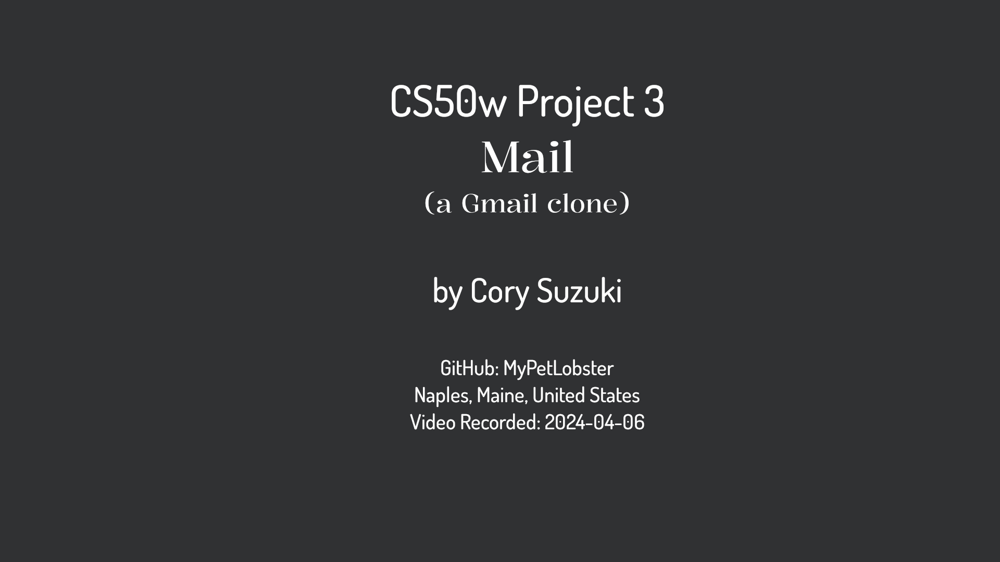</a>


**Site Screenshots**


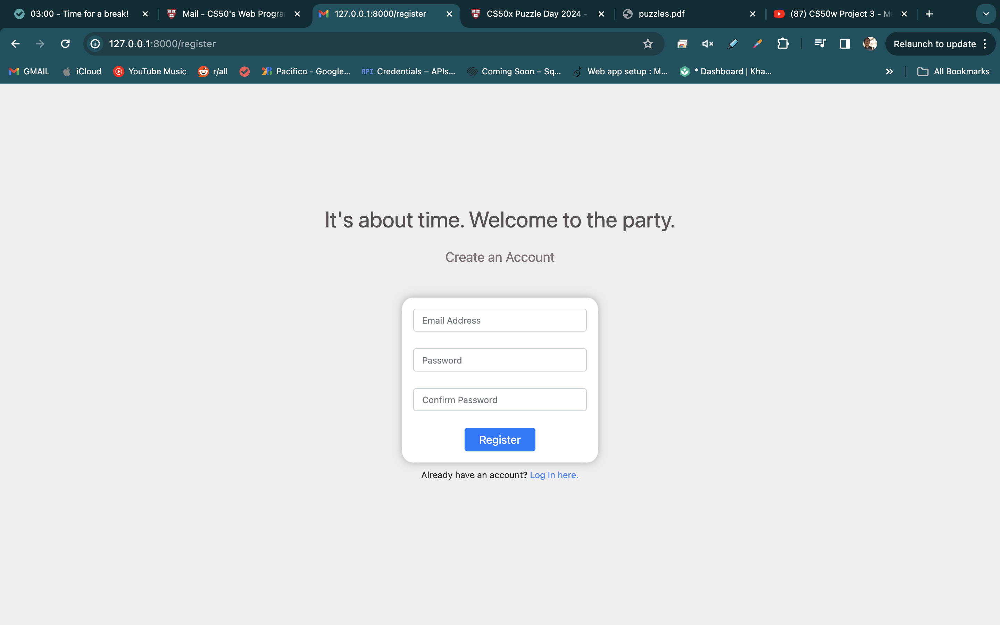
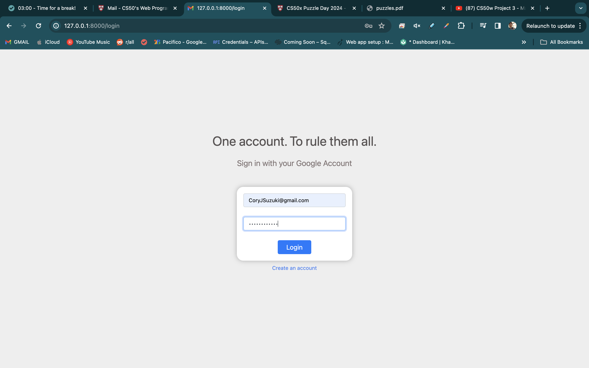
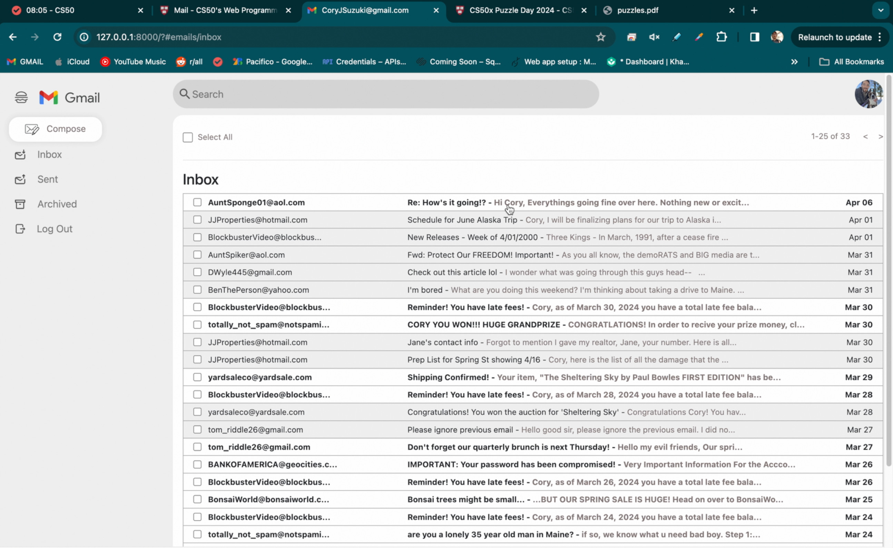
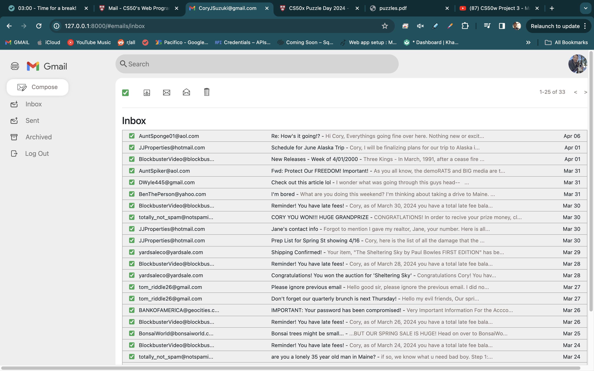
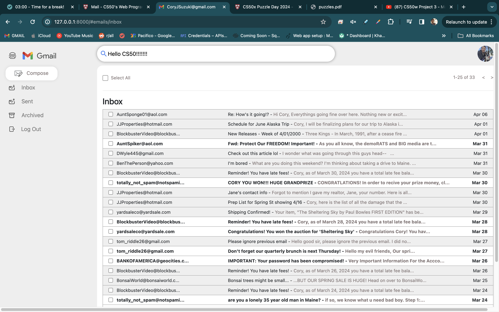
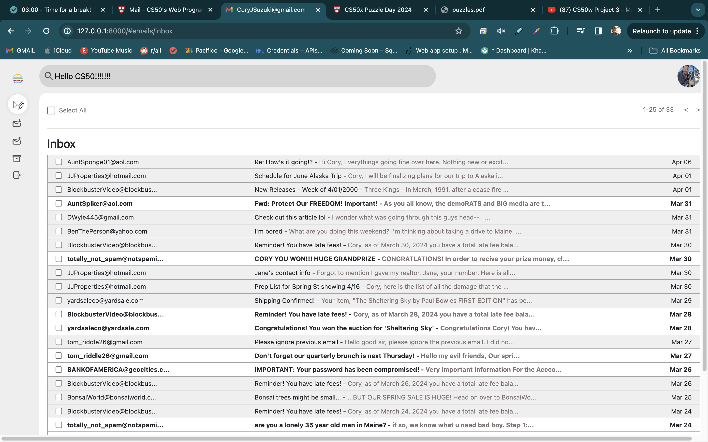
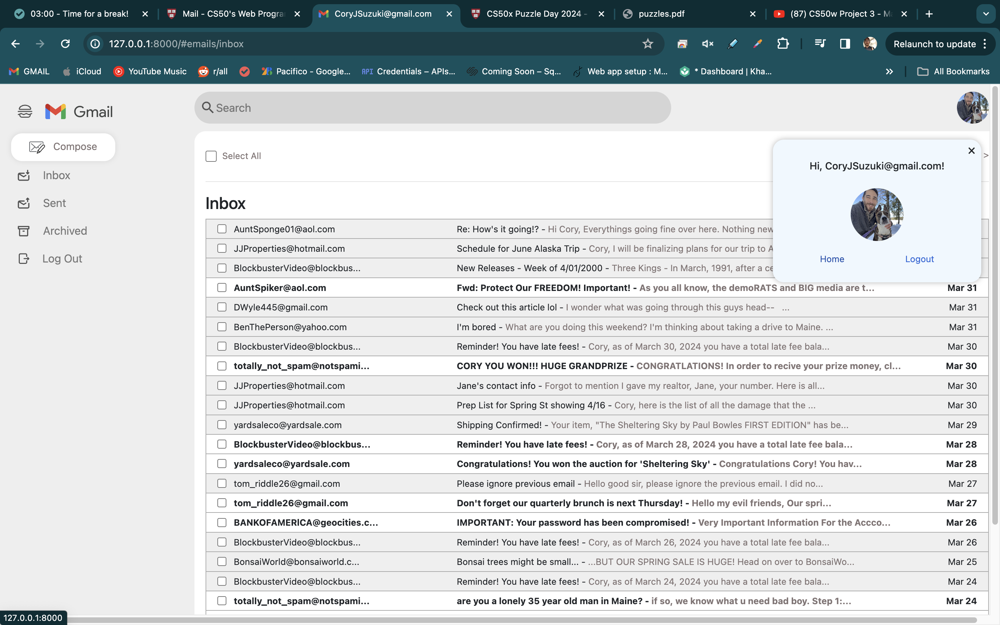
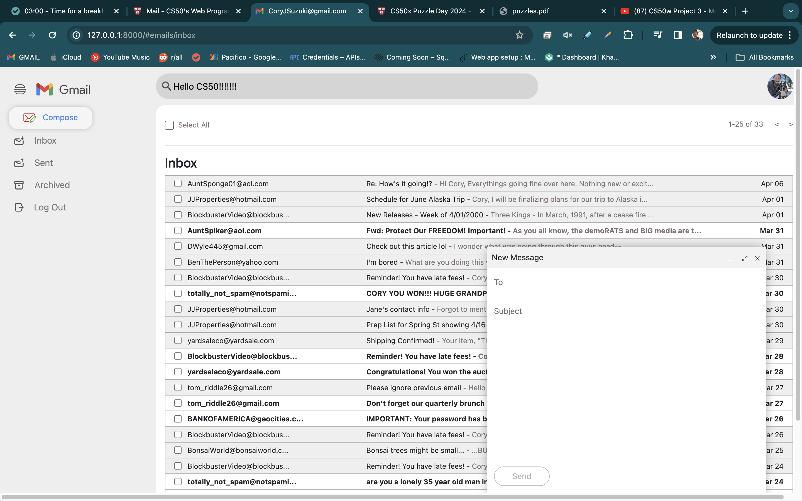
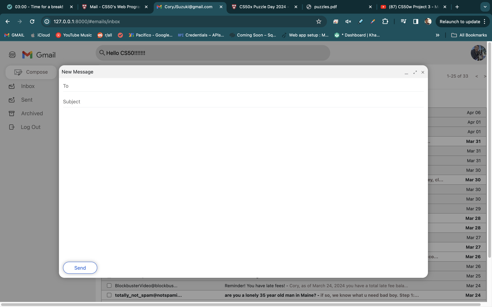
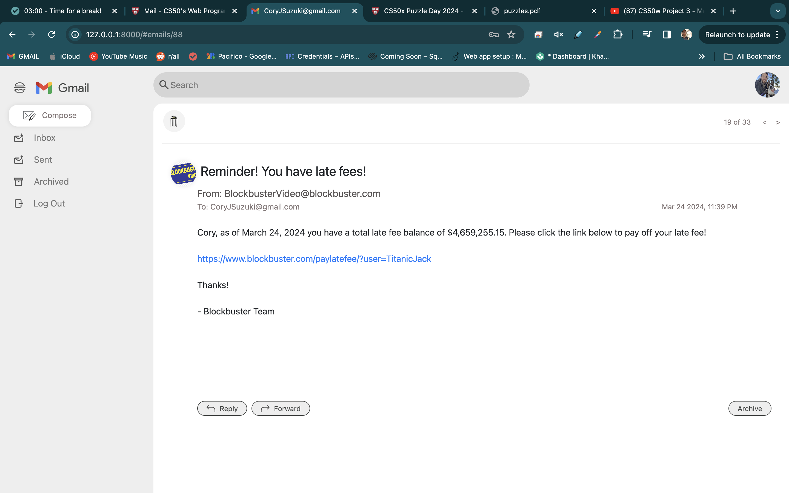

## Project Specifications

### 1. Send Mail
- When a user submits the email composition form, a POST request is made, passing the recipients, subject, and body of the email.

### 2. Mailbox
- Users can view their inbox, sent mail, and archived mail. When a mailbox is visited, a GET request is made with a string argument "mailbox" that determines which mailbox is being requested. The mailbox is then returned as a JSON response and rendered in the mailbox view.

### 3. View Email
- When a user clicks on an email, the email is rendered in the email view. A GET request is made with an integer argument "email_id" that determines which email is being requested. The email is then returned as a JSON response and rendered in the email view.

### 4. Archive and Unarchive
- Users can archive and unarchive emails that they have received. When viewing an email, there is a button rendered below the body text, beside the reply and forwards buttons. When clicked, a PUT request is made to update the email's archived status. Along with 'read/unread', the archived status can be changed from the mailbox view as well (see batch processing below).

### 5. Reply
- Users can reply to an email. When viewing an email, there is a button rendered below the body text that allows users to reply to the email. When clicked, the email composition form is pre-filled with the recipient, subject, and body of the email being replied to. The subject line should begin with "Re: " followed by the original subject, only for the first reply. Forwards should begin with "Fwd: ", no limit on the number of times the prefix can be added.


## Additional Features

1. **Batch Email Processing**
    - Select all functionality that allows users to select all emails in a mailbox (on the current page)
    - Users can mark selected emails as read or unread, archived or unarchived, or delete them all at once.
    - Because of the limitations set in the project instructions, I did not want to modify any Python files,
    so for now, the search and trash functionality are only cosmetic. This may be updated after the project has been graded.

2. **Pagination**
    - Used JavaScript to handle pagination. Created two variables, emailsPerPage and currentPage. I used the values of 
    those variables to determine an offset value. Then used that offset value to get a slice of the returned email array 
    depending on the current page. I also used the currentPage variable to update the url in the address bar.
    - Also implemented arrows that allow users to go forward and back one page at a time when viewing a mailbox, and one
    email at a time when viewing an email.

3. **Clone Gmail Features and Styles**
    - Hover effects, icons, and colors are all inspired by Gmail.
    - Search bar and buttons are styled to match Gmail.
    - Additional proper hamburger icon. None of this three-line nonsense.
    - Clicking hamburger will collapse sidebar.
    - Clone Gmail's compose form, including expanding and minimizing form.

4. **Profile Pictures**
    - First implemented using template tags custom_filters.py file, but then remembered that I am only  
    supposed to use JavaScript, HTML and CSS, so I just changed the name of the profile picture jpgs to match the usernames stored in the database.


## Usage

### Optional -- Included Test Database
- A test database is included with sample data for testing and demonstration purposes.


### Installation and startup
1. Install Django.
2. Clone the project repository.
3. Set up the database and run migrations. (Optional: use the included test database)
4. Run the Django development server.


```bash
python manage.py makemigrations
python manage.py migrate
python manage.py runserver
```

## Things I Learned and Challenges

After completing the project requirements, I decided to add additional features to further challenge myself. With the previous project, Commerce, I spent a ton of time creating a custom look for my auction site. I used Sass for the styling in that project and much of the actual functionality was done with Python. For this project, in order to adhere to the project guidelines, I was only able to use JavaScript, HTML, and CSS. This was a great opportunity to learn to use JavaScript for purposes beyond basic interactivity in my projects. 

I also wanted to try to stay more focused with my CSS. I tend to treat the styling stage as a never-ending abstract painting,
just throwing stuff against a wall and seeing what sticks. I enjoy it quite a bit and I think I'm fairly decent at making 
things look the way I imagine them. But I want to get better at following best practices and writing cleaner code. So I kept
the styling for this project simple and tried to emulate Gmail as closely as possible. (with some added flair of course...hamburger menu icon!)

Even with these rules in mind, it wasn't until I was finished with my project that I realized I actually broke one of those rules by creating a custom_filters.py file. This was only used to parse a user's username from their email address in order to select the proper jpg file for the profile picture displayed in each email. I deleted the file and changed the names of the jpg files to match the usernames stored in the database. This is obviously not scalable and I have not implemented any means of users uploading their own profile pictures. But I think I like to make the projects feel alive before I record the 
demonstration videos.

I spent a lot of time reading about the History API and how to use it to manage state. I was able to get the back and forward buttons in my browser to work using history.push/replaceState, but I got stuck for a bit trying to figure out how to make the refresh button work properly. In the end I decide to pass an empty string to the pushState and replaceState methods. Then in order to update the url in the address bar, I used hashed urls. I still need to learn more about this, I have a feeling there are better ways to handle this. But I didn't want to spend a ton of time on this one feature, so once I finally got it working, I moved on.

After taking over a month to complete the previous project, I was determined not to let this project drag on for so long. I set a goal to complete it in two weeks. Turns out I was able to complete all of the requirements within about two hours. I then spent my free time for the next week adding additional features and modeling my CSS styling after Gmail. I'm happy with the results and I'm glad I was able to complete the project in a timely manner. I'm looking forward to the next project, which I believe will be the penultimate project for the course. 